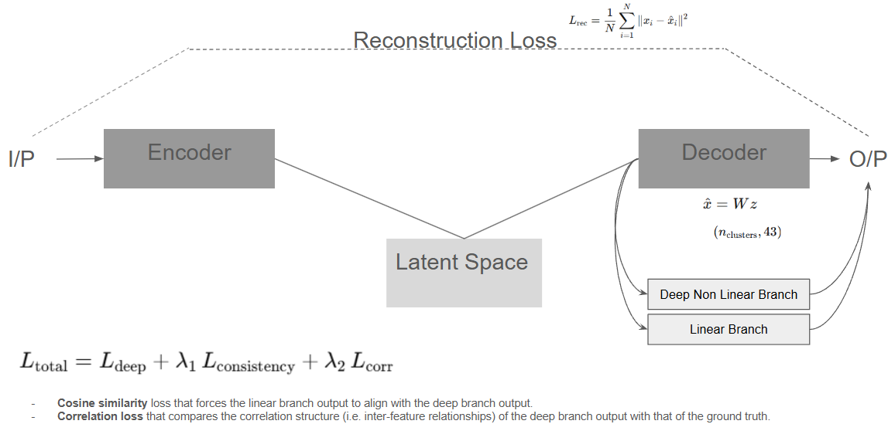

# Emission Source Profiling using Autoencoder-based Unsupervised Learning

 

## Project Title
**Interpretable Source Separation of ACSM Spectral Data using Deep Autoencoders**

## Overview
This project aims to separate and identify emission sources from Aerosol Chemical Speciation Monitor (ACSM) spectral data collected at the Lawrenceville site in Pittsburgh. It leverages deep convolutional autoencoders to generate interpretable factor profiles, similar to traditional Positive Matrix Factorization (PMF) methods.

Developed in affiliation with the **Center for Atmospheric Particle Studies (CAPS)** at **Carnegie Mellon University**, this tool is tailored for environmental researchers interested in atmospheric source apportionment.

---

## Problem & Motivation
Traditional source separation techniques like Non‑negative Matrix Factorization (NMF) and PMF are widely used for ACSM data but are limited in capturing complex nonlinear dependencies in the spectra. This project offers a deep learning–based alternative that:

- Reconstructs spectral data with high fidelity.  
- Produces **interpretable and non‑negative linear factor outputs**.  
- Incorporates tailored loss functions to maintain structural consistency and correlation patterns.

---

## ⚙️ Methodology
The autoencoder architecture includes:

1. **Encoder:**  
   5 convolutional blocks compress the spectral input into a low‑dimensional latent representation.

2. **Dual‑Branch Decoder:**  
   - **Deep Branch:** Reconstructs the spectrum using upsampling and skip connections from the encoder.  
   - **Linear Branch:** Produces a non‑negative interpretable profile mimicking PMF outputs via a constrained Dense layer.

### Loss Functions
- **MSE Loss:** Supervises the deep branch for accurate reconstruction.  
- **Consistency Loss:** Aligns the linear and nonlinear decoder outputs via a cosine similarity penalty.  
- **Correlation Loss:** Ensures the reconstructed spectra preserve the original feature‑wise correlations.

---

## Usage

### Step 1: Install Dependencies
```bash
pip install -r requirements.txt
```
Python 3.8+ recommended.

### Step 2: Train the Model
```bash
python src/training.py
```
You will be prompted for:
- Raw data file containing the ACSM data (in `data/raw/`)
- Number of epochs, batch size, number of clusters or factors
- Learning rate, consistency loss weight (`lambda1`), correlation loss weight (`lambda2`)
- Linear branch regularization (`l1`, `l2`)

Trained artifacts are saved to:
```
saved_models/
├── autoencoder_model.h5
└── linear_weights.npy
```

### Step 3: Visualize Results
Open `test.ipynb` to:
- Load `linear_weights.npy`
- Plot heatmaps and bar charts of factor profiles
- Compare with NMF profiles using correlation matrices, scatter grids, and difference/ratio charts

---

## Project Structure
```
Unsupervised_Learning/
├── data/
│   ├── raw/                # Raw ACSM CSV files
│   └── processed/          # Normalized data outputs
├── saved_models/           # autoencoder_model.h5, linear_weights.npy
├── src/
│   ├── __init__.py
│   ├── config.py           # Seed settings & paths
│   ├── data_preprocessing.py
│   ├── models.py           # Encoder, decoder, autoencoder classes
│   ├── training.py         # CLI for interactive training
│   └── visualisation.py    # Plotting utilities
├── test.ipynb              # Notebook for evaluation & comparison
├── requirements.txt
├── README.md
└── .gitignore
```

---

## Contact
For questions or collaborations, reach out to Abhinit Mahajan at  
✉️ abhinitmahajan@cmu.edu

---

## 📄 License
This project is licensed under the MIT License. See LICENSE for details.

---

## Acknowledgements
Developed in affiliation and supervision with   
**Prof. Albert Prestro**
**Center for Atmospheric Particle Studies (CAPS)**  
**Carnegie Mellon University**
