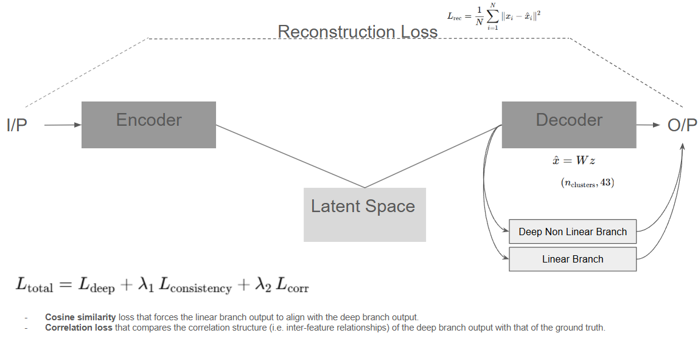

# Emission Source Profiling using Autoencoder-based Unsupervised Learning

 

## Project Title
**Interpretable Source Separation of ACSM Spectral Data using Deep Autoencoders**

## Overview
This project aims to separate and identify emission sources from Aerosol Chemical Speciation Monitor (ACSM) spectral data collected at the Lawrenceville site in Pittsburgh. It leverages deep convolutional autoencoders to generate interpretable factor profiles, similar to traditional Positive Matrix Factorization (PMF) methods.

Developed in affiliation with the **Center for Atmospheric Particle Studies (CAPS)** at **Carnegie Mellon University**, this tool is tailored for environmental researchers interested in atmospheric source apportionment.

---

## Problem & Motivation
Traditional source separation techniques like Non‑negative Matrix Factorization (NMF) and PMF are widely used for ACSM data but are limited in capturing complex nonlinear dependencies in the spectra. This project offers a deep learning–based alternative that:

- Reconstructs spectral data with high fidelity.  
- Produces **interpretable and non‑negative linear factor outputs**.  
- Incorporates tailored loss functions to maintain structural consistency and correlation patterns.

---

## ⚙️ Methodology
The autoencoder architecture includes:

1. **Encoder:**  
   4 convolutional blocks (32→64→128→256 filters) with residual connections and max pooling, followed by a 512-filter bottleneck, compressing input to a K-dimensional latent space.

2. **Dual‑Branch Decoder:**  
   - **Deep Branch:** Reconstructs spectrum via upsampling with skip connections from encoder.  
   - **Probabilistic Branch:** Produces PMF-style factor profiles via temperature-scaled softmax over factor logits.

### Loss Functions
- **MSE Loss:** Supervises the deep branch for accurate spectrum reconstruction.  
- **PMF KL Loss:** Enforces probabilistic reconstruction where each sample is a mixture of global factor profiles.  
- **Consistency Loss:** Aligns deep and linear reconstructions via cosine similarity.  
- **Correlation Loss:** Preserves feature-wise correlation structure of the input spectra.  
- **Orthogonality Penalty:** Encourages diverse, non-overlapping factor profiles.  
- **Entropy Sparsity:** Promotes sharp per-sample factor assignments for clearer source attribution.

---

## Usage

### Step 1: Install Dependencies
```bash
pip install -r requirements.txt
```
Python 3.8+ recommended.

### Step 2: Train the Model
```bash
python src/training.py
```
You will be prompted for:
- Raw data file containing the ACSM data (in `data/raw/`)
- Number of epochs, batch size, number of clusters or factors
- Learning rate, consistency loss weight (`lambda1`), correlation loss weight (`lambda2`)
- Linear branch regularization (`l1`, `l2`)
- **Temperature:** Controls factor profile sharpness (lower = more focused, higher = smoother). Default: 1.0
- **Orthogonality Weight:** Promotes diverse factor profiles (higher = more distinct factors). Default: 0.01
- **Entropy Weight:** Encourages sparse factor usage per sample (higher = sharper assignments). Default: 0.001

Trained artifacts are saved to:
```
saved_models/
├── autoencoder_model.h5
├── factor_logits_weights.npy
└── probabilistic_factors.npy  # PMF-comparable factor profiles
```

### Step 3: Run Experiments
```bash
python run_experiments.py
```
Automated parameter sweep across factor counts, orthogonality weights, and entropy weights.

### Step 4: Analyze Results
```bash
python analyze_experiments.py    # Factor distinctiveness vs NMF
python calculate_q_metrics.py    # Q/Qexp fit quality metrics
```

### Step 5: Visualize Results
Open `test.ipynb` or use `src/visualisation.py` to:
- Load `probabilistic_factors.npy` (PMF-style factor profiles)
- Plot heatmaps and bar charts of factor profiles
- Compare with NMF profiles using correlation metrics

---

## Project Structure
```
caps_cmu/
├── data/
│   ├── raw/                # Raw ACSM CSV files
│   └── processed/         # Normalized data outputs
├── saved_models/           # Trained models and factor profiles
├── experiment_results_*/   # Timestamped experiment outputs
├── analysis_results_*/     # Analysis outputs (orthogonality, entropy, q_metrics)
├── src/
│   ├── config.py           # Seed settings & paths
│   ├── data_preprocessing.py
│   ├── models.py           # Encoder, decoder, autoencoder classes
│   ├── training.py         # CLI for interactive training
│   └── visualisation.py    # Plotting utilities
├── run_experiments.py      # Automated parameter sweep experiments
├── analyze_experiments.py  # Factor analysis vs NMF comparison
├── calculate_q_metrics.py  # Q/Qexp metric calculation
├── test.ipynb              # Notebook for evaluation & comparison
├── requirements.txt
└── README.md
```

---

## Contact
For questions or collaborations, reach out to Abhinit Mahajan at  
✉️ abhinitmahajan@cmu.edu

---

## 📄 License
This project is licensed under the MIT License. See LICENSE for details.

---

## Acknowledgements
Developed in affiliation and supervision with   
**Prof. Albert Prestro**
**Center for Atmospheric Particle Studies (CAPS)**  
**Carnegie Mellon University**
